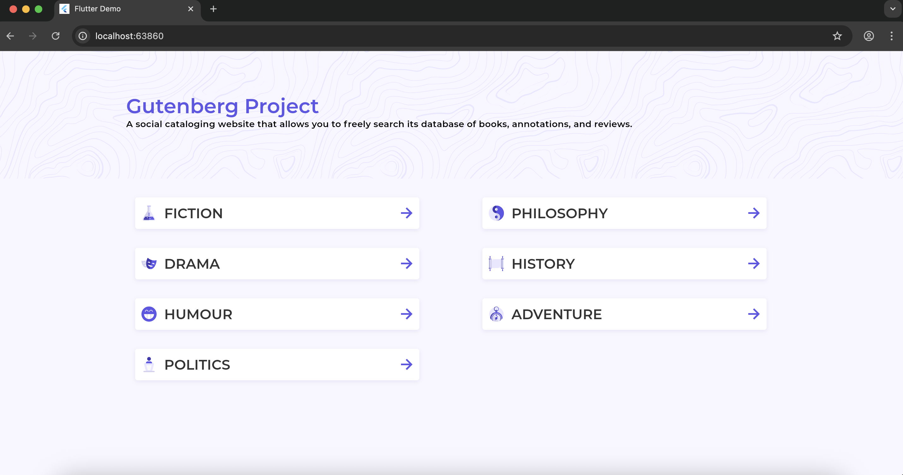

# Ignitesol Demo – Flutter Book Browser

> **⚠️  Note on Flutter Web images**  
> Project Gutenberg’s cover images are served without permissive CORS headers. When you run the app in a web browser the requests are therefore blocked and the images are replaced with a placeholder. This is a backend privacy policy; the mobile/desktop builds show images normally.

A multi-platform Flutter application that lets you browse Project Gutenberg books by topic, search within a topic, and open book details in your browser.  
It showcases a modern Flutter stack: **Dio** for networking, **Bloc** for state-management, and responsive layouts for web & mobile.

---

## ✨ Features

| Feature | Description |
|---------|-------------|
| Responsive UI | Different layouts for web (`BookWebScreen`) and mobile (`BookMobileScreen`). |
| Category & Search | Browse by topic and perform free-text search inside any topic. |
| Pagination | Handles the API’s `next` URL to fetch additional pages. |
| Bloc State-Management | `BookBloc` coordinates API calls and exposes `BookLoading`, `BookLoaded`, etc. |
| Dio Networking | Centralised `ApiService` with interceptors and time-outs. |
| CORS-Safe Images | If the book cover blocks CORS, the UI shows a graceful fallback icon + message. |
| Deep Linking | Tapping a book card opens the book’s page on Project Gutenberg using `url_launcher`. |

---

## 🗂 Directory overview

```
lib/
  ├─ const/            # Reusable constants (colors, images, strings)
  ├─ model/            # Plain-dart data classes (Book, Author)
  ├─ services/
  │   └─ api_service.dart     # Dio singleton + REST helpers
  ├─ presentation/
  │   └─ books/
  │       ├─ bloc/            # BookBloc, events & states
  │       ├─ widget/          # Reusable widgets (BookCard, search box)
  │       ├─ mobile/          # Mobile-specific screen
  │       └─ web/             # Web-specific screen
  └─ theme/            # App-wide ThemeData
```

---

## 🚀 Getting started

### Prerequisites

* Flutter SDK (3.10+ recommended).  
  Check with `flutter --version`.

### 1. Install dependencies

```bash
flutter pub get
```

### 2. Run on mobile/emulator

```bash
flutter run -d android        # or ios
```

### 3. Run on web (default port)

```bash
flutter run -d chrome
```

#### Custom web port (e.g. `localhost:8080`)

```bash
flutter run -d chrome --web-port 8080            # launches Chrome
# OR
flutter run -d web-server --web-hostname localhost --web-port 8080
```

Open the printed URL in your browser — usually <http://localhost:8080>.

---

## 🔧 Configuration

No runtime environment variables are required.  
`ApiService` points to the public API `http://skunkworks.ignitesol.com:8000`.

---

## 🧪 Testing

```bash
flutter test
```

(No widget/unit tests are included yet – PRs welcome!)

---

## 📡 API reference

* **List books** – `GET /books?topic=<topic>&mime_type=image/&search=<query>`
  * Supports pagination via `next` URL in the response.

See [Project Gutenberg API](https://gutendex.com/) docs for more.

---

## 🤝 Contributing

1. Fork & clone this repo.
2. Create a feature branch (`git checkout -b feature/my-feature`).
3. Commit your changes (`git commit -m 'Add cool feature'`).
4. Push to the branch (`git push origin feature/my-feature`).
5. Open a Pull Request.

---

## 📃 License

This project is licensed under the MIT License — see the [LICENSE](LICENSE) file for details.

## 📸 Screenshots

Screenshots live in the `docs/screenshots/` folder so they’re bundled with the repo (GitHub automatically serves them).
Once you capture and save images there they’ll appear inline below.

| Desktop / Web |  |
|--------------|--|
|  <td></td>
|  <td></td>
|  <td></td>

| Mobile |  |
|--------|--|
|  <td></td>
|  <td></td>
|  <td></td>

> Replace the placeholder file names with your actual PNG/JPEGs to see them rendered here.